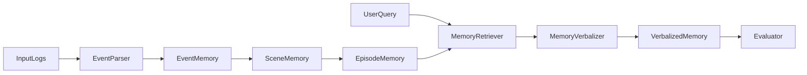

# 毕设方案：具身智能情景记忆语言化（小样本/零样本）

## 研究定位与问题定义
- 研究主题：具身智能情景记忆语言化（Episodic Memory Verbalization, EMV）。
- 目标任务：在小样本/零样本条件下，将结构化情景记忆转换为可检索、可解释的自然语言叙述。
- 约束条件：不使用实体机器人，采用仿真与公开日志；聚焦小框架解决单一科学问题。
- 参考思路：借鉴H-EMV的“分层情景表征+语言化”思想，不直接复现具体方法。

## 科学问题与研究问题
- 科学问题：在极少样本/零样本条件下，如何将空间-时间-事件的情景记忆有效语言化，并保持一致性与可解释性？
- Q1：如何设计轻量分层情景表示，使少样本下仍能生成清晰叙述？
- Q2：如何在零样本条件下进行可靠的记忆检索并驱动语言化？
- Q3：如何量化“记忆语言化”的质量、覆盖度与解释性？

## 研究假设与创新点
- 假设H1：分层记忆表示能提升语言化的一致性与结构完整性。
- 假设H2：检索驱动的语言化策略在零样本下优于纯生成式策略。
- 创新点：
  - 轻量分层记忆表示（Event/Scene/Episode）与可控语言化的结合。
  - “结构化提示 + 规则模板”作为小样本下的稳健下界。
  - 结构化一致性指标用于评价记忆语言化。

## 总体架构（小框架）
- SceneMemory：情景片段存储（事件、对象、位置、时间）。
- HierMemory：分层压缩（Event -> Scene -> Episode）。
- MemoryRetriever：语义检索 + 结构约束过滤。
- Verbalizer：模板与LLM融合的可控生成。
- Evaluator：事实一致性、覆盖度、叙述结构完整性评估。

### 模块输入输出与接口建议
- EventParser
  - 输入：原始日志（时间戳、坐标、动作、对象）。
  - 输出：事件元组 `(time, location, actor, action, object, attribute)`。
- EventMemory
  - 存储：事件序列，支持按时间与对象检索。
- SceneMemory
  - 规则：按时间窗或地点聚合事件形成Scene。
  - 输出：`Scene{id, time_range, location, events, key_objects}`。
- EpisodeMemory
  - 规则：按主题语义聚合多个Scene。
  - 输出：`Episode{id, topic, scenes, summary}`。
- MemoryRetriever
  - 输入：用户查询或提示。
  - 输出：相关Episode/Scene列表，附带相似度与一致性得分。
- MemoryVerbalizer
  - 输入：检索结果 + 结构化schema。
  - 输出：叙述文本（按时间顺序+因果关系）。

### 数据流细化
- 步骤1：日志解析为事件序列，并存入EventMemory。
- 步骤2：按时间窗或地点聚合成SceneMemory。
- 步骤3：对Scene进行语义聚类，形成EpisodeMemory。
- 步骤4：检索模块根据查询返回候选Episode/Scene。
- 步骤5：语言化模块生成叙述，并输出评价。

## 方法设计
### 分层记忆表示
- Event层：时间戳 + 对象 + 动作 + 位置 + 属性。
- Scene层：固定时间窗内事件聚合，形成局部语义片段。
- Episode层：跨Scene按主题或语义簇聚合。

### 小样本与零样本策略
- 小样本：规则模板 + 少量示例微调式提示（schema-based prompting）。
- 零样本：检索驱动语言化（先检索，再生成），并加入一致性约束。

### 语言化策略
- 结构化输入：以 JSON-like schema 组织记忆片段。
- 语言化输出：叙述式自然语言，包含时间顺序、对象与动作关系。

## 数据与实验设计
- 数据来源：
  - 公开日志或仿真轨迹（如室内活动日志、虚拟环境行为轨迹）。
  - 自建合成事件序列（脚本生成，控制复杂度）。
- 事件格式：
  - (time, location, actor, action, object, attribute)
- 任务设定：
  - 给定查询或上下文，输出对应情景记忆叙述。

### 公开数据与仿真建议
- 公开日志：选择带时间戳的活动识别或室内行为日志，提取事件序列。
- 仿真场景：基于脚本生成“房间-对象-动作”的序列，控制噪声与稀疏度。
- 小样本设置：每类场景仅保留少量示例（如1-5条episode）。
- 零样本设置：保留未见过的场景主题或对象组合。

### 结构化事件格式建议
- 基本字段：`time`, `location`, `actor`, `action`, `object`, `attribute`。
- 可选字段：`goal`, `tool`, `relation`, `duration`。
- Scene构建规则：
  - 以固定时间窗或地点聚合事件。
  - 统计关键对象与动作作为Scene摘要。

## 评估指标与消融实验
- 自动指标：
  - 事实一致性：生成叙述与事件匹配率。
  - 覆盖度：关键信息召回率。
  - 结构完整性：叙述结构是否包含时间-对象-动作链。
- 人工评估：
  - 可解释性、可读性、与记忆一致性。
- 消融实验：
  - 分层 vs 非分层记忆。
  - 检索驱动 vs 直接生成。
  - 模板语言化 vs LLM融合。

### 指标计算建议
- 事实一致性：
  - 从生成文本中抽取事件三元组，与记忆事件集合做匹配。
  - 计算 Precision / Recall / F1。
- 覆盖度：
  - 统计关键对象与动作在生成文本中的召回率。
- 结构完整性：
  - 检查是否包含“时间顺序、地点、动作、对象”的最小信息集合。

### 人工评估流程
- 评估维度：可读性、可解释性、与记忆一致性（1-5分）。
- 评估样本：从不同场景与难度抽样，保持小规模但覆盖多样性。
- 评价者：至少2人交叉评分，给出一致性分析。

## 风险与应对
- 数据不足：使用合成日志生成，控制变量。
- 评价主观：设计结构化一致性指标。
- 模型不稳定：模板规则作为下界结果。

## 毕设写作结构建议
- 引言：背景与动机，强调小样本/零样本。
- 相关工作：情景记忆、分层表示、语言化方法。
- 方法：分层记忆 + 检索驱动语言化架构。
- 实验：数据来源、任务设定、评价指标与消融。
- 结论与展望：局限、改进方向与未来应用。

### 章节细化与写作要点
- 第1章 引言：问题背景、研究意义、研究目标与贡献。
- 第2章 相关工作：情景记忆建模、分层表示、语言化与检索方法。
- 第3章 方法：分层记忆表示、检索策略、语言化模块与一致性约束。
- 第4章 实验：数据来源、任务设置、评估指标与消融设计。
- 第5章 结果与分析：指标对比、案例分析、失败模式讨论。
- 第6章 结论与展望：总结贡献、局限与未来方向。

### 进度安排建议（8-10周）
- 第1-2周：数据准备、事件格式确定、基线模板实现。
- 第3-5周：检索与语言化模块实现，完成分层记忆构建。
- 第6-7周：实验与消融，完善评估与可视化案例。
- 第8-9周：论文写作与结果整理。
- 第10周：修改与答辩准备。
